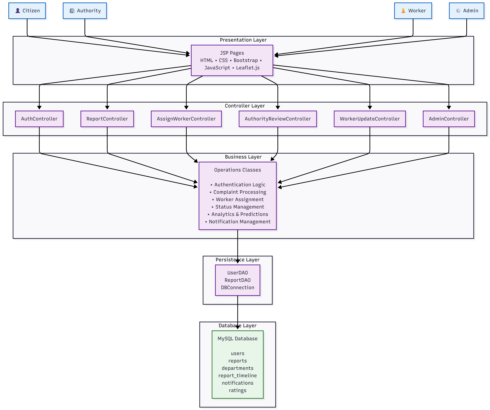

# LCPS - Local Community Problem Solver 🚀

A full-stack civic complaint management system that enables citizens to report local community issues, authorities to manage complaints, and workers to resolve them efficiently.

---

## 📌 Project Overview

Local Community Problem Solver (LCPS) is a web-based civic complaint platform developed using Java Servlets, JSP, JDBC, and MySQL following the MVC2 architecture.

The system allows citizens to report community problems such as:

* Potholes
* Garbage issues
* Water leakage
* Street light failures
* Road maintenance problems

Authorities can review complaints, assign workers, monitor progress, and verify completed work through image evidence and status timelines.

---

## ✨ Features

### Citizen Module

* User Registration & Login
* OTP Verification
* Report Civic Issues
* Upload Issue Images
* Select Location using Interactive Map
* Track Complaint Status
* View Timeline of Complaint Progress
* View Before and After Work Images

### Authority Module

* Department Dashboard
* View Department Reports
* Assign Workers
* Review Completed Work
* Approve or Reject Work
* Monitor Complaint Analytics

### Worker Module

* View Assigned Complaints
* Update Work Progress
* Upload After-Work Images
* Mark Complaints as Completed

### Admin Module

* Manage Users
* View System Analytics
* Monitor Complaint Statistics
* Reassign Reports Between Departments

### Analytics Module

* Status-wise Report Analytics
* Department-wise Report Analytics
* Average Resolution Time Prediction

---

## 🛠 Tech Stack

### Frontend

* JSP
* HTML5
* CSS3
* JavaScript
* Bootstrap
* Leaflet.js

### Backend

* Java Servlets
* JDBC
* MVC2 Architecture

### Database

* MySQL

### Server

* Apache Tomcat 11

### Language

* Java 21

---
# 📸 Screenshots

## Report Issue with Live Location

---

## Authority Dashboard

---

## Admin Analytics Dashboard

---

## 🏗 System Architecture

LCPS follows the MVC2 (Model-View-Controller) architecture using Java Servlets, JSP, JDBC and MySQL. The system consists of Citizen, Authority, Worker and Admin modules that communicate through a layered architecture comprising Presentation, Controller, Business and DAO layers.

## 🚀 Future Improvements

* Email Notifications
* SMS Notifications
* Complaint Heatmaps
* AI-Based Department Prediction
* Mobile Application
* Real-Time Notifications
* Machine Learning Based Complaint Prioritization

---

## 👨‍💻 Developer

**Yogesh Chettiyar**

B.Sc Computer Science
Thakur College of Science and Commerce
Mumbai, India

GitHub:
https://github.com/yogeshchettiyar069

## 📂 Project Structure

LCPS/
├── src/main/java/
│ ├── controller/
│ ├── operations/
│ ├── implementor/
│ ├── model/
│ ├── db_config/
│ ├── listener/
│ └── utils/
│
├── src/main/resources/
│ ├── config.properties
│ └── config.properties.example
│
├── src/main/webapp/
│ ├── admin/
│ ├── authority/
│ ├── citizen/
│ ├── worker/
│ ├── css/
│ ├── uploads/
│ └── WEB-INF/
│
└── screenshots/

